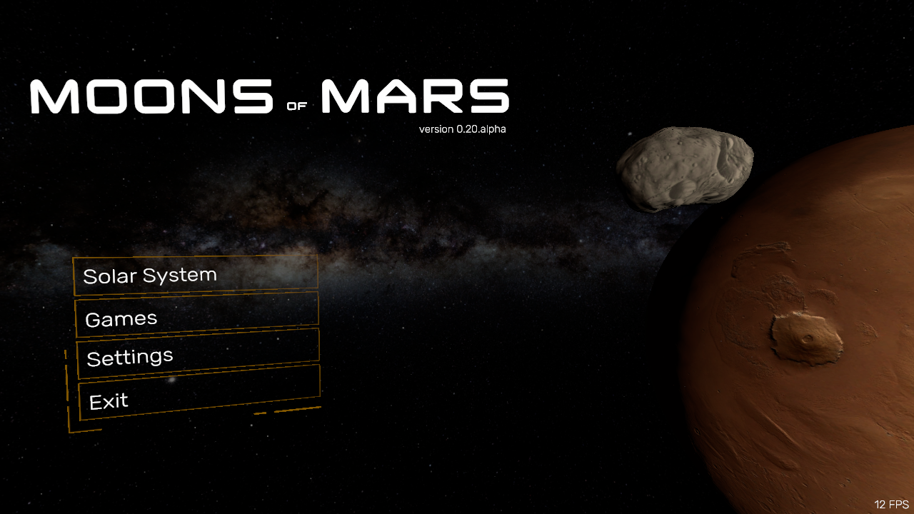
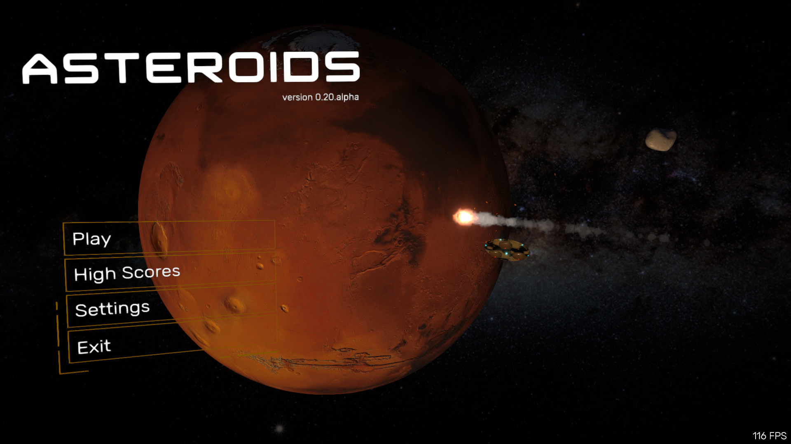

# Moons of Mars

## Description
This project is my playground to learn Unity. I love space games and space related stuff.
It is both distracting and therapeutic for me when I'm working on this project. 

## Credits
| Asset  | Url |
| --- | --- |
| Menu | https://assetstore.unity.com/packages/tools/gui/3d-modern-menu-ui-116144 |

# Solar System
An overview of the solar system with the major planets and moons.

[Placeholder image]

## Credits
| Asset  | Url |
| --- | --- |
| Unity3D Particle Sun Tutorial | https://www.youtube.com/watch?v=qJEBAPRt8AA |
| Celestial Bodies Textures & Models | www.celestiamotherlode.net |
| Kepler orbits | https://github.com/Karth42/SimpleKeplerOrbits |

| Music  | Title | Link |
| --- | --- | --- |
| Lexin Music | Cinematic Cello | https://pixabay.com/users/lexin_music-28841948 |
| Lexin Music | Space Ambient  Sci-fi | |

# Asteroids
Back in the days I didn't like to play Asteroids that much, too Difficult. Perhaps I can enjoy my own version more. 
At least I had fun creating it.

## Credits
| Asset  | Url |
| --- | --- |
| Rocket Model | https://assetstore.unity.com/packages/3d/vehicles/space/atom-rocket-model-140021 |
| Dalek model | https://sketchfab.com/3d-models/dalek-1ddd381f853c455a8ba602b1fe2f71c1 |

| Music  | Title | Link |
| --- | --- | --- |

